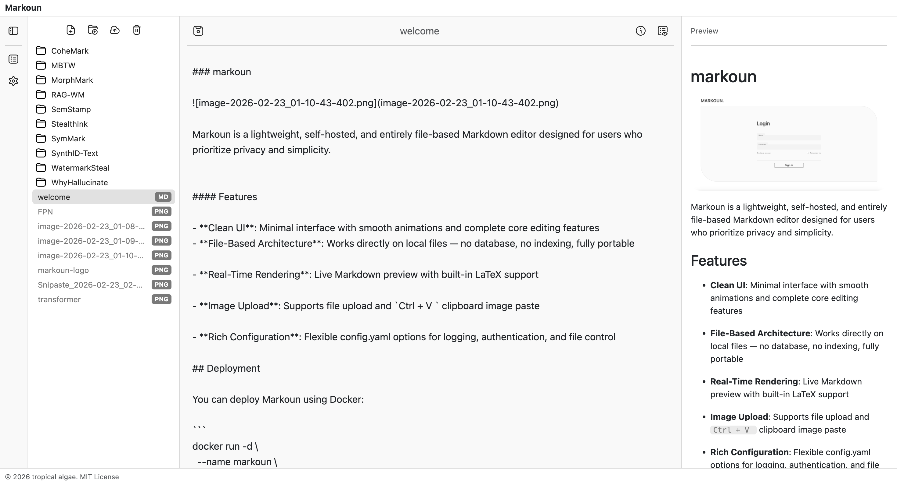

<div align="center"></div>
<p align="center"><strong><span style="font-size: 1.25em;">A self-hosted, file-based Markdown editor</span></strong></p>
<p align="center">
  <a href="README.md"></a>
</p>
<div align="center"></div>

Markoun is a lightweight, self-hosted, and entirely file-based Markdown editor designed for users who prioritize privacy and simplicity.

> The UI layout of Markoun is inspired by [Haptic](https://github.com/chroxify/haptic) and [Obsidian](https://github.com/obsidianmd) — both excellent Markdown editing tools.

## Features

- **Clean UI**: Minimal interface with smooth animations and complete core editing features

- **File-Based Architecture**: Works directly on local files — no database, no indexing, fully portable

- **LaTeX support**: Live Markdown preview with built-in LaTeX support

- **Image Upload**: Supports file upload and `Ctrl + V ` clipboard image paste

- **Rich Configuration**: Flexible config.yaml options for logging, authentication, and file control

## Deployment

You can deploy Markoun using Docker:

```
docker run -itd --name markoun \
  --restart unless-stopped \
  -p ${PORT:-80}:80 \
  -v ${MARKOUN_DATA_DIR:-$(pwd)/data}:/app/data \
  -v ${MARKOUN_CONFIG_FILE:-$(pwd)/config.yaml}:/app/config.yaml \
  tropicalalgae/markoun:latest

```

### Volume Explanation

| **Path**           | **Description**                            |
| ------------------ | ------------------------------------------ |
| `/app/data `       | Directory where Markdown files are stored. |
| `/app/config.yaml` | Main configuration file.                   |

## Configuration

Markoun is configured via a config.yaml file. Below are some important options:

| **Key**                                | **Description**                                                                                           | **Default**                                |
| -------------------------------------- | --------------------------------------------------------------------------------------------------------- | ------------------------------------------ |
| `DEBUG`                                | Enables/disable debug-level logging for the backend service.                                              | false                                      |
| `ACCESS_TOKEN_DEFAULT_EXPIRE_MINUTES`  | **Standard Session Lifetime**: Duration (in minutes) a user remains logged in before the session expires. | 1440                                       |
| `ACCESS_TOKEN_EXTENDED_EXPIRE_MINUTES` | **Persistent Session Lifetime**: Duration (in minutes) for users who select "Remember Me" during login.   | 43200                                      |
| `DISPLAYED_FILE_TYPES`                 | **File Filter**: A list of file extensions that the editor is permitted to display.                       | ["md", "png", "jpg", "jpeg", "bmp", "svg"] |

## Editor Details

**Relative Image Paths**:
When inserting images into a Markdown file, image paths are generated relative to the Markdown file’s location — not the project root. This ensures portability and correct rendering even if folders are moved.

**Rename by Long Press**:
Long-press on a file or folder name in the sidebar to rename it.

**File Visibility Rules**:
By default, the sidebar displays only Markdown files and common image formats. To show additional file types, modify DISPLAYED_FILE_TYPES in config.yaml.

## Limitations & Roadmap

- [] **Image security**: static image routes currently lack authentication checks
- [] **File system architecture**: design can be further optimized
- [] **UI polish**: incomplete animation feedback and styling inconsistencies
- [] **Frontend refactoring**: codebase requires further optimization

## License

This project is licensed under the [MIT License](https://github.com/tropical-algae/markoun/blob/main/LICENSE).
