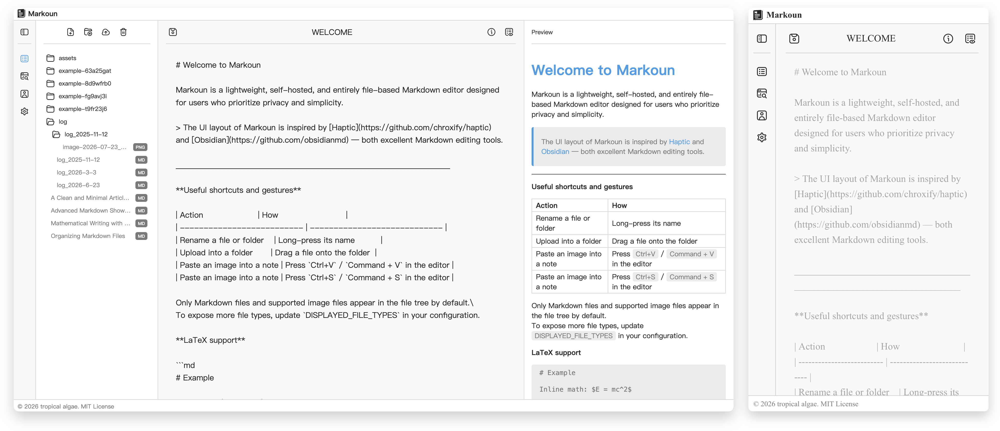

<div align="center"></div>
<p align="center"><strong><span style="font-size: 1.25em;">A self-hosted, file-based Markdown editor</span></strong></p>
<p align="center">
  <a href="README.md"></a>
  <a href="README_CN.md"></a>
  <a href="https://codecov.io/github/tropical-algae/markoun"></a>
  <a href="LICENSE"></a>
</p>
<div align="center"></div>

Markoun is a lightweight, self-hosted, and entirely file-based Markdown editor designed for users who prioritize privacy and simplicity.

> The UI layout of Markoun is inspired by [Haptic](https://github.com/chroxify/haptic) and [Obsidian](https://github.com/obsidianmd) — both excellent Markdown editing tools.

## Features

- **Clean UI**: Minimal interface with smooth animations and complete core editing features

- **File-Based Architecture**: Works directly on local files — no database, no indexing, fully portable

- **LaTeX support**: Live Markdown preview with built-in LaTeX support

- **Keyboard Shortcuts**: Paste clipboard images and save the current document without leaving the editor

- **Rich Configuration**: Flexible config.yaml options for logging, authentication, and file control

## Deployment

You can deploy Markoun using Docker:

```bash
export MARKOUN_PORT=10000
export MARKOUN_ROOT=./

touch ${MARKOUN_ROOT:-./}/config.yaml

docker run -itd --name markoun \
  --restart unless-stopped \
  -p ${MARKOUN_PORT:-10000}:80 \
  -e DEFAULT_ADMIN_NAME=admin \
  -e DEFAULT_ADMIN_EMAIL=admin@example.com \
  -e DEFAULT_ADMIN_PASSWORD=change-this-password \
  -v ${MARKOUN_ROOT:-$(pwd)}/data:/app/data \
  -v ${MARKOUN_ROOT:-$(pwd)}/config.yaml:/app/config.yaml \
  tropicalalgae/markoun:latest

```

> [!WARNING]
> Replace the example administrator credentials before starting the container.
> On a new installation, omitting these environment variables creates the default administrator with a randomly generated password.
> Run `docker logs -f markoun` to find the generated account credentials.

You can also create a new regular user from the homepage.

### Volume Explanation

| **Path**           | **Description**                                   |
| ------------------ | ------------------------------------------------- |
| `/app/data `       | Directory where Markdown files are stored.        |
| `/app/config.yaml` | Main configuration file.                          |
| `/app/welcome.md`  | Optional welcome note shown when no file is open. |

If you want to customize the default welcome page in Docker, mount your own Markdown file to `/app/welcome.md`, or point `WELCOME_NOTE_PATH` at a different mounted location.

## Configuration

Markoun is configured via a `config.yaml` file. Restart the service after
modifying this file for changes to take effect. Below are some important options:

| **Key**                                | **Description**                                                                                           | **Default**                                | **Since** |
| -------------------------------------- | --------------------------------------------------------------------------------------------------------- | ------------------------------------------ | --------- |
| `USER_WORKSPACE_ISOLATION`             | Uses `<DOCUMENT_ROOT>/<username>` as each authenticated user's workspace when authentication is enabled.  | false                                      | `v0.2.2`  |
| `MEDIA_DELIVERY_MODE`                  | Sends protected images through FastAPI (`application`) or an Nginx internal redirect (`nginx`).           | `nginx`                                    | `v0.2.2`  |
| `AUTH_REQUIRED`                        | Requires users to sign in before accessing and editing workspace files.                                   | true                                       | `v0.2.1`  |
| `DEBUG`                                | Enables/disable debug-level logging for the backend service.                                              | false                                      | `v0.0.1`  |
| `ACCESS_TOKEN_DEFAULT_EXPIRE_MINUTES`  | **Standard Session Lifetime**: Duration (in minutes) a user remains logged in before the session expires. | 1440                                       | `v0.0.1`  |
| `ACCESS_TOKEN_EXTENDED_EXPIRE_MINUTES` | **Persistent Session Lifetime**: Duration (in minutes) for users who select "Remember Me" during login.   | 43200                                      | `v0.0.1`  |
| `ACCESS_TOKEN_COOKIE_SECURE`           | Sends the auth cookie only over HTTPS. Enable this when the public site is served through HTTPS.          | false                                      | `v0.1.4`  |
| `DISPLAYED_FILE_TYPES`                 | **File Filter**: A list of file extensions that the editor is permitted to display.                       | ["md", "png", "jpg", "jpeg", "bmp", "svg"] | `v0.0.1`  |
| `WELCOME_NOTE_PATH`                    | Path to the Markdown file used as the default welcome page when no document is open.                      | `./welcome.md`                             | `v0.1.0`  |

For more configurable options, see [config.py](src/markoun/common/config.py)

> [!WARNING]
> Setting `AUTH_REQUIRED` to `false` gives every visitor full access to read, create, edit, upload, move, and delete workspace files.
> Only disable authentication on a trusted network or behind another access-control layer.

## Editor Details

**Keyboard Shortcuts**:

| **Action**            | **Windows / Linux** | **macOS**     |
| --------------------- | ------------------- | ------------- |
| Paste clipboard image | `Ctrl + V`          | `Command + V` |
| Save current document | `Ctrl + S`          | `Command + S` |

**Relative Image Paths**:
When inserting images into a Markdown file, image paths are generated relative to the Markdown file’s location — not the project root. The renderer resolves them through the protected media API, preserving portability without exposing the physical workspace path.

**Rename by Long Press**:
Long-press on a file or folder name in the sidebar to rename it.

**Drag-and-Drop Upload**:
Drag a local file onto a folder in the sidebar to upload it directly into that folder.

**File Visibility Rules**:
By default, the sidebar displays only Markdown files and common image formats. To show additional file types, modify `DISPLAYED_FILE_TYPES` in `config.yaml`.

**System configuration**:
Administrators can manage these options from the sidebar settings:

- Enable or disable user registration.
- Group pasted images by note, storing them in a folder named after the Markdown file.

## Limitations & Roadmap

- [x] **Image security**: static image routes currently lack authentication checks
- [x] **File system architecture**: design can be further optimized
- [x] **UI polish**: incomplete animation feedback and styling inconsistencies
- [ ] **Settings expansion**: add more configurable options for personalization and workflow control
- [x] **Quick actions & interaction enhancements**: support more intuitive and efficient operations
- [x] **Improved usability**: provide a smoother and more comfortable operation experience
- [x] **Enhanced previews**: support richer previews, including image preview and ~~Gantt chart rendering~~ in Markdown files
- [x] **Frontend refactoring**: codebase requires further optimization
- [ ] **File synchronization**: support syncing files with a remote source
- [ ] **Version management**: introduce file versioning with history tracking and restore capability
- [ ] **Deployment options**: support more installation and deployment methods across different environments

## License

This project is licensed under the [MIT License](https://github.com/tropical-algae/markoun/blob/main/LICENSE).
